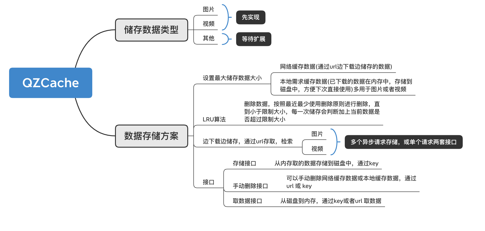
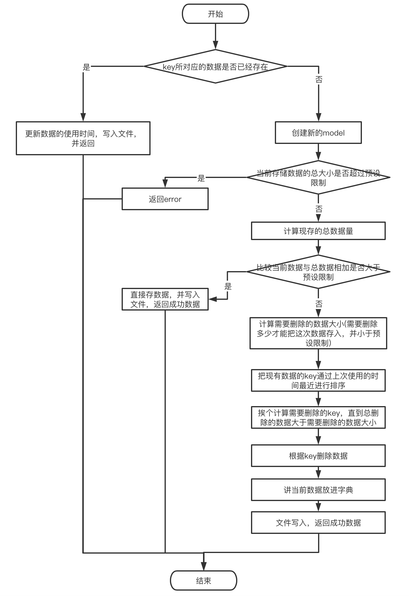

#数据缓存工具
------
本项目的初衷主要是个人的学习所导向。如果有设计不当或者错误的地方，欢迎大佬们评论里面指出。谢谢
##1、纲领设计

###存储数据类型
主要是基于图片和视频等需要占用较大磁盘或者内存空间的数据进行一个缓存处理的轻量级工具，功能较少，其他数据，例如普通字符串，NSNumber等相关数据暂不作考虑。可以后期扩展。

##2、接口
```
/*
 设置最大下载缓存 单位为MB
 默认为50MB
 */
-(void)configMaxDownLoadSizeOfMB:(double)max;
/*
 查看当前设置的最大下载缓存
 */
-(double)catMaxDownLoadSize;
/*
 存储下载数据
 */
-(void)storageDownLoadData:(NSData *)data withKey:(NSString *)key completion:(nullable void (^)(NSError * _Nullable error))completion;

-(void)storageLocalData:(NSData *)data withKey:(NSString *)key completion:(nullable void (^)(NSError * _Nullable error))completion;
/*
 读取数据
 */
-(id)readDataForKey:(NSString*)key;
/*
 手动删除数据
 */
-(BOOL)removeDataForKey:(NSString *)key;
/*
 设置最大本地缓存 单位为MB
 默认为50MB
 */
-(void)configMaxLocalSizeOfMB:(double)max;
/*
 查看当前设置的最大本地缓存
*/
-(double)catMaxLocalSize;
```
以上是控制缓存的主要接口，包括设置下载缓存最大限制(单位为MB)，手动缓存数据最大限制(单位为MB)，本地手动缓存接口，下载数据缓存接口，以及读取数据，手动删除数据等。另外还提供了基于NSURLSession的网络请求下载资源的接口，如下：

```
/*
 单个请求
 success：返回数据一般返回时nsdata
 failure：返回error
 */
+(void)requestDownLoadURL:(NSString *)url success:(nullable void (^)(_Nullable id responseObject))success
                                  failure:(nullable void (^)(NSError * _Nullable error))failure;
/*
 多个请求
 success：返回数据一般返回时nsdata，和请求成功的url
 failure：返回error
*/
+(void)requestDownLoadURLs:(NSArray<NSString*>*)urls success:(nullable void (^)(NSData * _Nullable responseObject , NSString * url))success
                                                     failure:(nullable void (^)(NSError * _Nullable error))failure;

```
包括单个url请求，和多条url请求。多条请求采用异步请求策略，并使用栅栏的方式保证数据读写的安全。
##3、实现
1、关于数据：
	图片，视频，数据转换成统一的 NSData，使用NSData的length属性获取到其占用的内存大小。

2、关于网络下载：
	使用NSURLSession 网络请求，多个异步请求需要提供url 数组，数据请求完成之后，会给一个请求成功回调，并在回调中存储数据，存储成功后再把数据带回，失败则调用失败回调。
	
```
+(void)requestDownLoadURLs:(NSArray<NSString*>*)urls success:(nullable void (^)(NSData * _Nullable responseObject , NSString * url))success
                                                     failure:(nullable void (^)(NSError * _Nullable error))failure{
    
    //队列
    dispatch_queue_t download_completion_queue = dispatch_queue_create("qz.qzcache.QZResourceDownloadQueue", DISPATCH_QUEUE_SERIAL);
    [urls enumerateObjectsUsingBlock:^(NSString * _Nonnull obj, NSUInteger idx, BOOL * _Nonnull stop) {
        if ([[QZCacheManager shareManager]readDataForKey:obj] != nil) {
            //如果缓存中有数据， 则直接取
            success([[QZCacheManager shareManager]readDataForKey:obj],obj);
        } else {
//            无则发起网络请求
           [[[NSURLSession sharedSession] dataTaskWithURL:[NSURL URLWithString:obj] completionHandler:^(NSData * _Nullable data, NSURLResponse * _Nullable response, NSError * _Nullable error) {
               dispatch_async(download_completion_queue, ^{
                   if (data.length > 0 && ((NSHTTPURLResponse *)response).statusCode == 200){
                       //处理数据存储
                       [[QZCacheManager shareManager]storageDownLoadData:data withKey:obj completion:^(NSError * _Nullable error) {
                           if (error == nil) {
                               success(data,obj);
                           } else {
                               failure(error);
                           }
                       }];
                   } else {
                       if (error != nil) {
                            failure(error);
                       }
                   }
               });
           }]resume];
        }
    }];
}
```
数据请求成功后调用QZCacheManager的下载缓存方法

```
-(void)storageDownLoadData:(NSData *)data withKey:(NSString *)key completion:(nullable void (^)(NSError * _Nullable error))completion;

```

```
-(void)storageDownLoadData:(NSData *)data withKey:(NSString *)key completion:(nullable void (^)(NSError * _Nullable error))completion {
    [self storageData:data withKey:key isDownLoad:YES completion:completion];
}

-(void)storageLocalData:(NSData *)data withKey:(NSString *)key completion:(nullable void (^)(NSError * _Nullable error))completion {
    [self storageData:data withKey:key isDownLoad:NO completion:completion];
}

```
通过接口判断本地手动缓存还是下载缓存，接下来调用核心函数

```
-(void)storageData:(NSData *)data withKey:(NSString *)key isDownLoad:(BOOL)isDownLoad completion:(nullable void (^)(NSError * _Nullable error))completion{
    NSMutableDictionary * dataDic = isDownLoad ? self.downLoadData : self.localData;
    [self.dataAccessor writeWithGCD:^{
        //如果数据存在则修改最后使用时间
        if ([dataDic valueForKey:key] != nil) {
            QZCacheDataModel *lastModel = [[QZCacheDataModel alloc]initWithDictionary:dataDic[key]];
            [lastModel updateUseDate];
            dataDic[key] = [lastModel dictionary];
            [dataDic writeToFile:[QZCacheManager pathOfQZCacheDownLoad] atomically:YES];
            completion(nil);
            return;
        }
        QZCacheDataModel *model = [QZCacheDataModel new];
        model.data = data;
        model.length = data.length;
        model.lastUseDate = [NSDate date];
        NSUInteger allBytes = [[[dataDic allValues]valueForKeyPath:@"@sum.length"]unsignedIntegerValue];;
        NSUInteger max = isDownLoad ? self.maxDownLoadSize * 1024 * 1024 : self.maxLocalSize * 1024 * 1024;
        if (data.length > max) {
            NSError *error = [NSError errorWithDomain:@"The data exceeds the maximum limit" code:5001 userInfo:nil];
            completion(error);
            return;
        }
        if (allBytes + data.length < max) {
            //小于直接存
            dataDic[key] = [model dictionary];
        } else {
            NSUInteger removeSize = data.length - (max - allBytes); // 需要删除的数据大小
            //根据最后使用时间把key排序
            NSArray<NSString*> *arrangement = [dataDic keysSortedByValueUsingComparator:^NSComparisonResult(id _Nonnull obj1, id _Nonnull obj2) {
                QZCacheDataModel *m1 = [[QZCacheDataModel alloc]initWithDictionary:obj1];
                QZCacheDataModel *m2 = [[QZCacheDataModel alloc]initWithDictionary:obj2];
                return [m1.lastUseDate compare:m2.lastUseDate];
            }];
            __block NSUInteger removeCurrentSize = 0;
            NSMutableArray<NSString *> *removeKeyArr = [NSMutableArray new];
            [arrangement enumerateObjectsUsingBlock:^(NSString * _Nonnull obj, NSUInteger idx, BOOL * _Nonnull stop) {
                if (removeCurrentSize < removeSize) {
                    QZCacheDataModel *currentModel = [[QZCacheDataModel alloc]initWithDictionary:self.downLoadData[obj]];
                    removeCurrentSize += currentModel.length;
                    [removeKeyArr addObject:obj];
                } else {
                    *stop = YES;
                }
            }];
            [removeKeyArr enumerateObjectsUsingBlock:^(NSString * _Nonnull obj, NSUInteger idx, BOOL * _Nonnull stop) {
                [dataDic removeObjectForKey:obj];
            }];
            //存储
            dataDic[key] = [model dictionary];
        }
        //写入本地缓存
        [dataDic writeToFile:[QZCacheManager pathOfQZCacheDownLoad] atomically:YES];
        completion(nil);
    }];
}
```
逻辑流程图如下

其余简单逻辑可参考代码
pod命令：

```
pod 'QZCache'
```

[github代码连接](https://github.com/huqinzhi/QZCache)<br>
